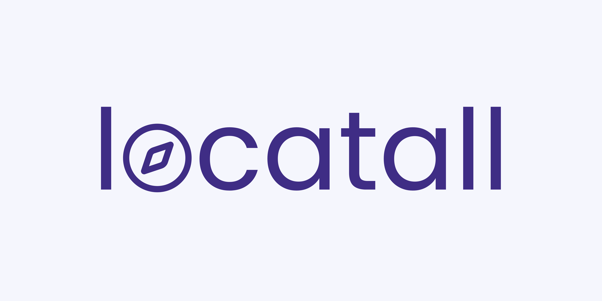

### **Everything you need, close to you.**

# Locatall

Locatall is a web application designed to help you find the best places nearby based on your location and preferences.

🚀 Main features

- 🔎 **Place Search**: Find nearby places in different categories such as food, entertainment, health, shopping and more.
- 📍 **Filters by Category and Place Type**: Explore different types of places within each category, such as restaurants, gyms, museums, parks, etc.
- 📏 **Distance Selection**: Search for locations in customisable radii (1 km, 5 km or 15 km). 
- 📊 **Sorted by Popularity**: Check the best rated places in the area according to Google Places score.
- 🎨 **Simple and Dynamic Interface**: Interactive and responsive design for a smooth experience on any device.

## Release Notes

- [Version 0.4.0](./release-notes/version-0.4.0.md)
- [Version 0.3.0](./release-notes/version-0.3.0.md)
- [Version 0.2.0](./release-notes/version-0.2.0.md)
- [Version 0.1.0](./release-notes/version-0.1.0.md)

## Technologies

## License 

gotoeat is open-source and licensed under the [Apache License 2.0](LICENSE).
